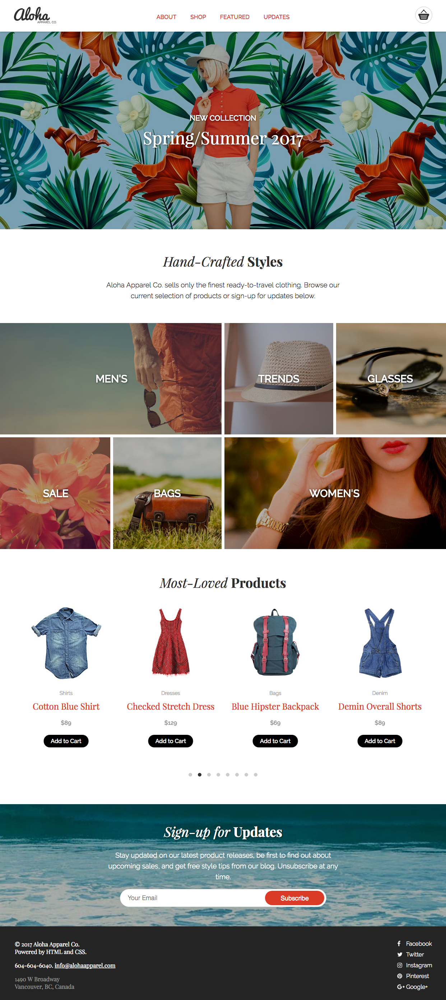
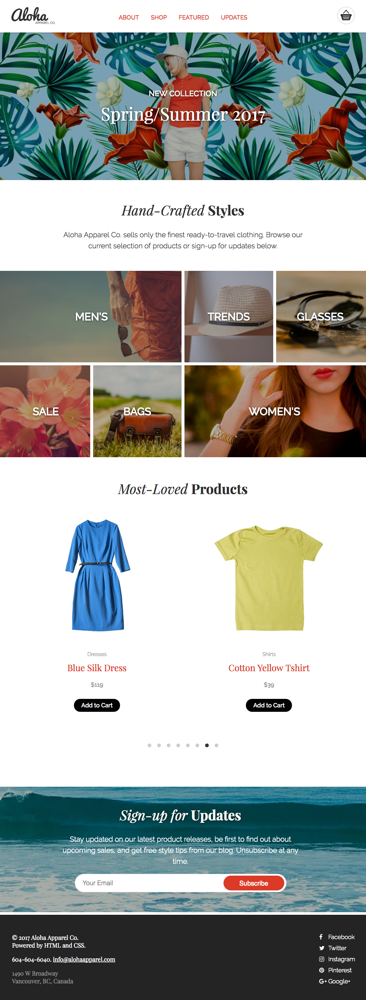

##### Aloha Apparel Co.'s README
# Aloha Apparel Co. (homepage)
It is the homepage created for Aloha Apparel Co., a responsive website mainly using HTML and CSS and some JavaScript and jQuery. It shows the major contents of this company on this page, such as what Aloha Apparel Co. is, what it is selling, what it is currently promoting and how users can get its updates. It is also an e-commerce store.

## Structure 
It divides into several sections:
1. Header (has the logo, the main navigation bar, the cart icon which users know how many they put in cart)
2. A large banner section
3. An about section
4. A shop categories section
5. A featured items section
6. An update and subscribe section
7. Footer (has the contact and social media information)

## Technologies Used
#### RWD
- Use a mobile-first approach (min-width: 600px and min-width: 1240px)
- Mobile view: 0-600px
- Tablet view: 600-1240px
- Desktop view: >1240px

#### HTML
- Use the HTML5 doctype and semantic HTML5 mark-up
- Work with a list-based navigation menu

#### CSS
- Use CSS3 properties 
- Use flexbox layout properties (no float properties)
- Use an icon font (fontawesome.com)

#### JS
- Able to smooth scrolling
- Use a jQuery plugin for the carousel (flickity.metafizzy.co)
- Validate email address for subscription
- Add items to shopping cart

#### Others
- Test the cross browsers compatibility (Chrome, Firefox, Safari, Opera, IE11)

### Difficulty
I learned all these languages within these two weeks. As a beginner, I had a hard time on how to apply the knowledge on this project. At the beginning, I draw many sketches and figured out how the html structure is. I use the header as an example, I need to know how display:flex, flex-basis are use, how many div it needs for the logo, navigation bar and cart separately. After that, I had a clear picture in mind of the site structure and helped me to add classes and organize elements more efficiency. For the responsive design, I listed out all the differences between mobile, tablet and desktop view. As well as how it changes between various views. At the end, I had the issue on cross browsers compatibility, especially on Firefox, the background images in the shop categories section are not showing. It is because of flexbox layout and padding properties, also the relationship of the parent and children. Therefore, I reorganized the div elements in that section and understood that the flexbox property cannot be the parent of the padding property (which is padding-top: 100%; in this case). After solving that, this page is completely worked in all major browsers.

## Screenshot

(Desktop view)

(Tablet view)

(Mobile view)